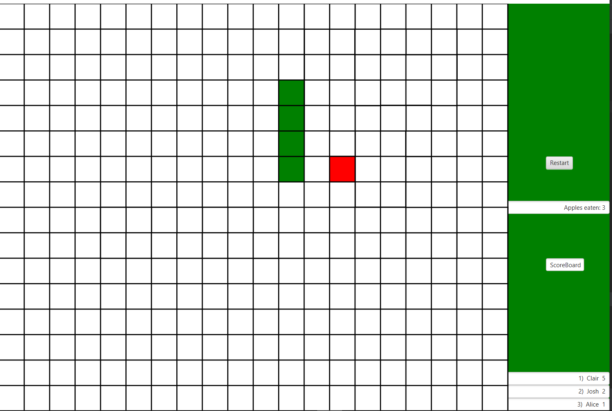
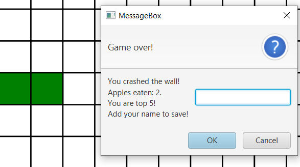
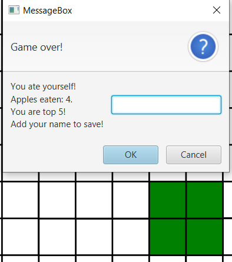

# Snake game by tothdodo

## Preview

A basic snake game with its functionalities and rules. It was written in Kotlin and JavaFX was used to built it.

## Technologies

- Kotlin
- JavaFX
- IntelliJ

## Functionalities

- Start the game
- Restart the game
- Move the snake
- Change direction of the snake
- Eat the apple with the snake, increase its size and your points
- Go to walls with the snake -> Game over
- Eat the snake itself -> Game over
- List yourself on scoreboard

## Screenshots

1) Maze while playing + score board

2) Game over 1 + Saving your score

3) Game over 2 + Saving your score

